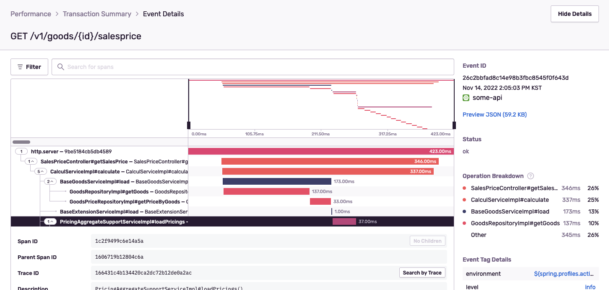

# Sentry Performance for Spring

Support breadcrumb of spans monitoring in sentry performance feature for Spring.



## Modules

* sentry-performance-core - Sentry Core
* sentry-performance-support - Sentry Breadcrumb 및 Span 지원
* spring-boot-sentry-performance-starter - Spring Boot 를 위한 Auto-Configuration (annotation 기반으로 이용할 경우 사용)

## Usage

### 공통

`build.gradle` 에 의존성 추가

```groovy
implementation group: 'kr.pe.karsei.helper', name: 'sentry-performance-support', version: '1.0.0'

// annotation 기반으로 이용하고 싶을 경우 추가
implementation group: 'kr.pe.karsei.helper', name: 'spring-boot-sentry-performance-starter', version: '1.0.0'
```

`application.yml`/`application.properties` 에 아래와 같이 sentry trace sampling 작성 (수치는 어플리케이션별로 적절히 입력)

```yaml
sentry:
  traces-sample-rate: 0.2
  sample-rate: 1
```

> https://docs.sentry.io/platforms/java/guides/spring-boot/configuration/sampling/

### Pointcut 적용

적용하길 원하는 Pointcut 작성

```java
public class SentryPointcut {
    @Pointcut("execution(public * com..*Controller.*(..))")
    public void controllerPointcut() {}
    @Pointcut("execution(public * com..*Service.*(..))")
    public void servicePointcut() {}

    @Pointcut("controllerPointcut() || servicePointcut()")
    public void classPointcuts() {}
}
```

Around 작성

```java
@Aspect
@RequiredArgsConstructor
public class SentryAspect {
    private final IHub iHub;

    @Around("SentryPointcut.classPointcuts()")
    public Object aroundAspect(ProceedingJoinPoint proceedingJoinPoint) throws Throwable {
        return SentryAround.trace(iHub, proceedingJoinPoint);
    }
}
```

Bean 등록

```java
@Configuration
public class SentryConfiguration {
    @Bean
    public SentryAspect sentryAspect(IHub iHub) {
        return new SentryAspect(iHub);
    }
}
```

### Annotation 적용

`@SentryPerformance` 사용

```java
@RestController
@RequestMapping
public class TestController {
    @GetMapping
    @SentryPerformance
    public ResponseEntity<?> test() {
        // ...
    }
}
```